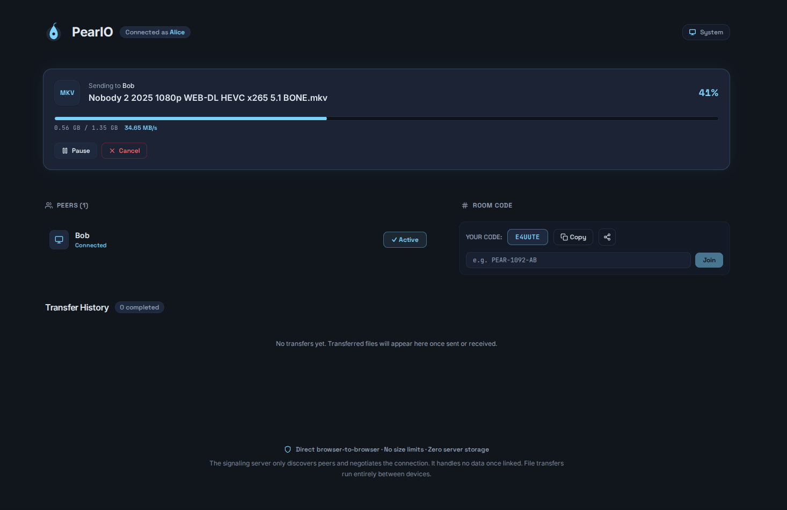
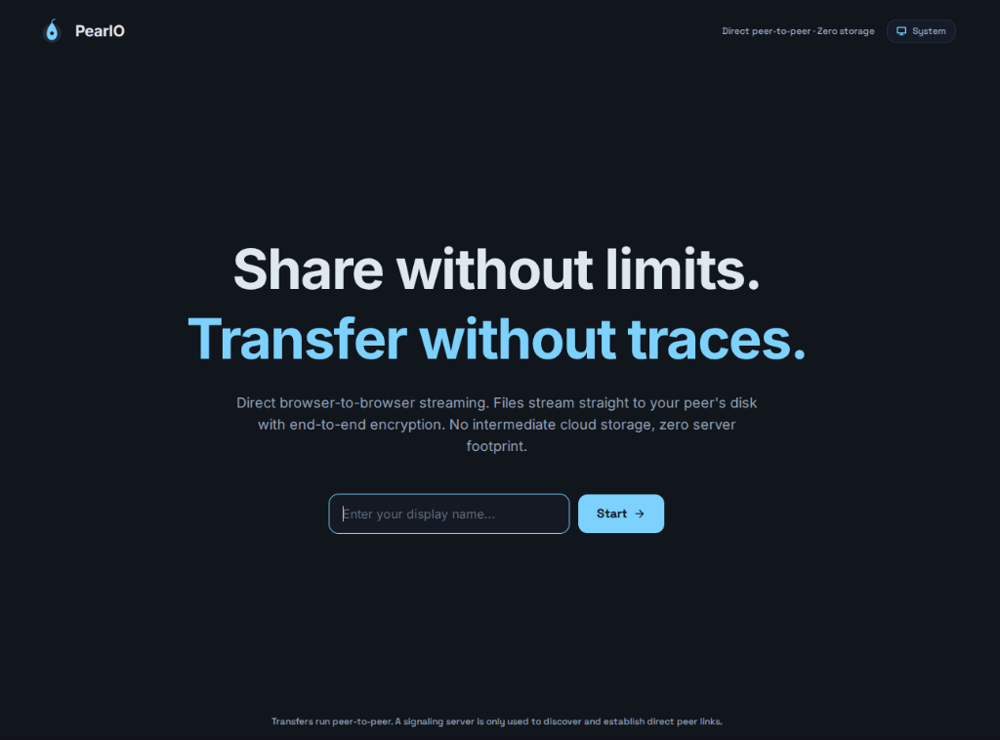
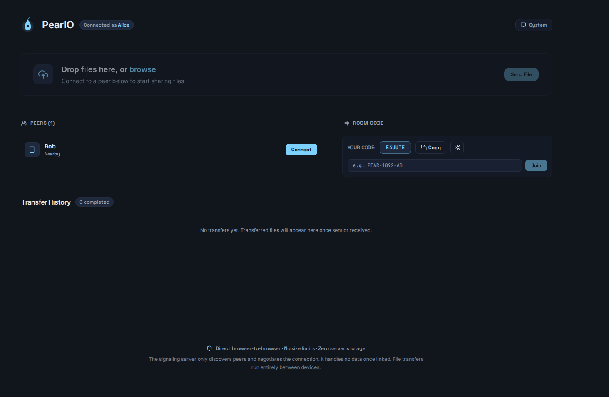
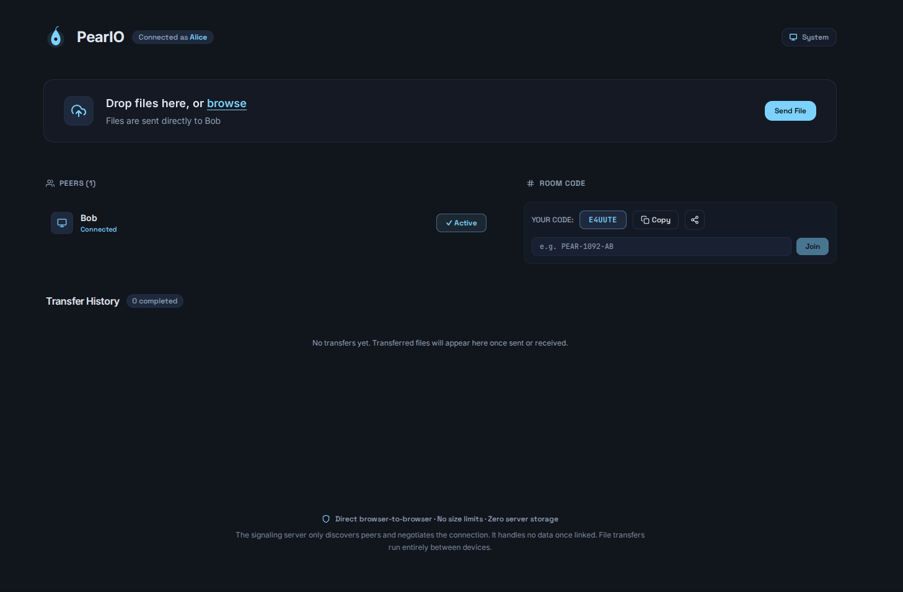
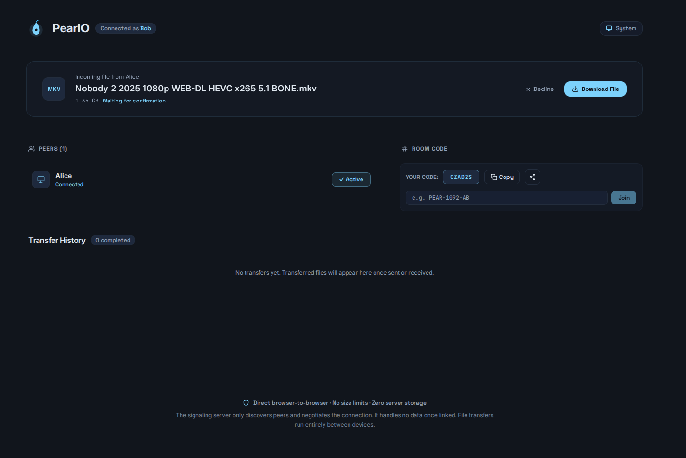
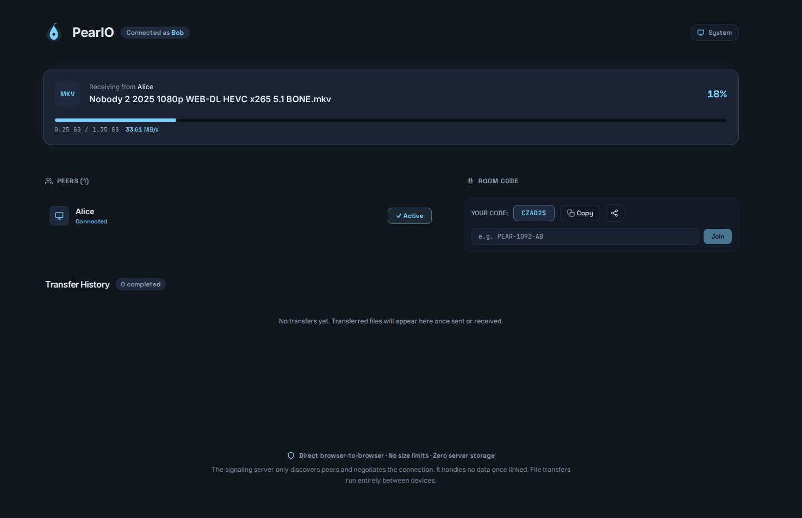
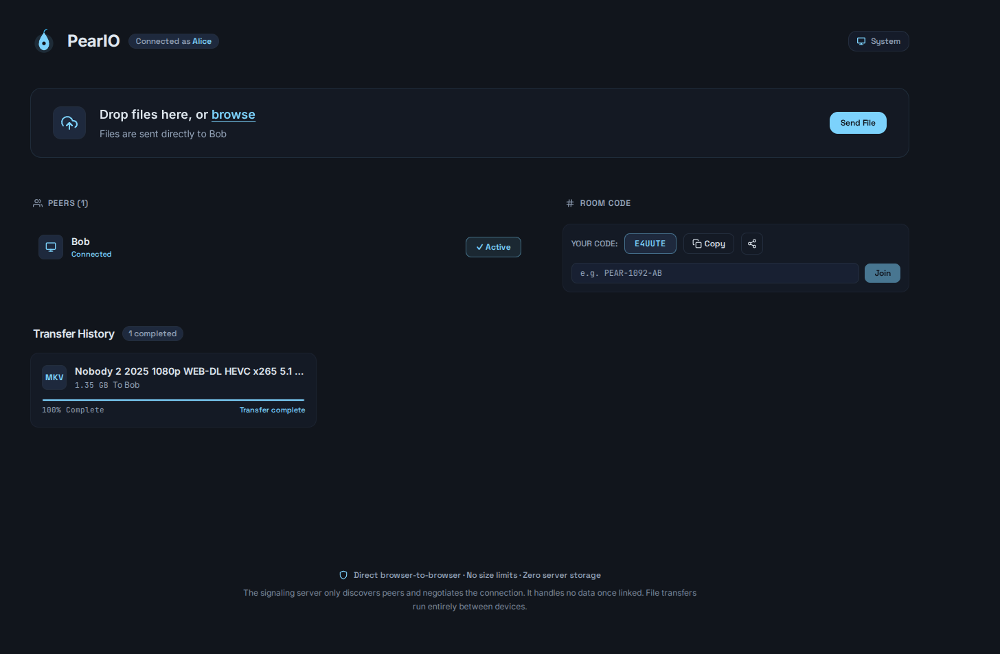

# Peario

Peario is a peer-to-peer file transfer tool that moves files directly between browsers using WebRTC. Files stream directly between peers rather than uploading to a server, and data writes straight to disk on receipt to keep memory usage flat.



## Using it

1. Pick a display name to start the session.
2. Share connection details. Use the room code, shareable link (`?room=CODE`), or pick a peer from the local discovery list.
3. Connect with other peer.
4. Choose a file to send. The recipient receives a prompt with the filename and size to accept or decline.
5. Monitor the transfer. Both sides display progress and transfer speed. The sender can pause or cancel at any time.

The receiving browser selects the destination file path (depends on your browser settings). Incoming chunks write directly to disk as they arrive, allowing large files to transfer without loading the entire payload into RAM.

Both browser tabs must remain open until the transfer completes.

## Screenshots

### Joining and discovering peers

Set a display name to enter the session:



Discover peers on the same local network or connect using a room code:



### Connecting

Once connected, peers show an active connection state:



### Sending and receiving files

The recipient inspects file name and size before accepting:



The sender monitors progress and speed, with controls to pause or cancel:


The receiver tracks throughput and percentage completed:



### Disk streaming and history

Files are streamed directly to disk without keeping anything in memory.

Transfers in the current session are listed under transfer history:



## What it does not do

- No cloud storage. Files are never stored on an intermediary server or database.
- No offline transfers. Both peers must keep active browser tabs open at the same time.
- No accounts. Sessions and display names are ephemeral.
- No fall.

## How it works

When you open Peario, the browser opens a WebSocket connection to the signaling server via Socket.IO. The signaling server tracks active socket IDs and room codes to exchange WebRTC session descriptions (SDP offer/answer) and ICE candidates between peers. The signaling server never receives or relays file bytes.

Once peers connect, they establish a direct `RTCPeerConnection`. If both peers can negotiate a direct route via STUN, packets travel browser-to-browser. If symmetric NATs or restrictive firewalls prevent direct routing, traffic falls back to a TURN relay server that forwards encrypted packets (uses METRD and not enabled by default).

File transfers use two distinct WebRTC data channels:

- Control channel: Reliable, ordered channel for handshake messages, file metadata, transfer acceptance, pause/resume signaling, and cancellations.
- Binary channel: High-throughput channel for transferring file chunks. The sender streams chunks using backpressure checks against `bufferedAmount` to prevent memory bloat, while the receiver writes incoming chunks directly to disk using the File System Access API (or a service worker fetch stream fallback).

## For developers

Peario is structured as a Bun monorepo:

- `apps/client`: React 19, Vite, Tailwind CSS, Socket.IO client. Manages UI state, WebRTC peer lifecycles, chunked streaming, and disk writes.
- `apps/server`: Bun HTTP server with Socket.IO. Handles peer discovery, room routing, signaling relays, and temporary TURN credential generation. State remains in memory with no database dependency.
- `packages/shared`: Shared TypeScript types and Zod validation schemas for signaling messages and file transfer protocols.

### Run it locally

Requires Bun 1.1 or later.

```bash
bun install
bun run dev
```

The client runs at `https://localhost:5137` and the signaling server runs at `https://localhost:8080`. Local TLS certificates are generated into `.certs/` on first run via `vite-plugin-mkcert`.

To run components individually:

```bash
bun run dev:client
bun run dev:server
```

### Configuration

Server environment variables:

- `PORT`. Signaling port. Defaults to `8080`.
- `NODE_ENV`. Set to `production` for production builds.
- `ALLOWED_ORIGINS`. Comma-separated list of allowed CORS origins. Required in production.
- `TLS_CERT_PATH` and `TLS_KEY_PATH`. File paths to TLS certificate and private key.

Client environment variables (prefixed with `VITE_`):

- `VITE_SIGNALING_SERVER_URL`. Target signaling server URL (for example, `https://localhost:8080`).
- `VITE_METERED_APP_NAME` and `VITE_METERED_API_KEY`. Metered TURN service credentials for relay fallback.
- `VITE_TURN_SECRET`. Secret token to unlock TURN relays via query parameter (`?turn=CODE`).

### Checks and tests

```bash
bun run type-check
bun run lint
bun run format:check
bun run test
```

End-to-end integration tests using Playwright:

```bash
bun run test:e2e
bun run test:e2e:large
```

## Browser compatibility

| Browser                  | Streams to disk | Memory use |
| ------------------------ | --------------- | ---------- |
| Chrome desktop 152, 153  | Yes             | Flat       |
| Chrome Android 152       | Mostly          | Flat*      |
| Firefox desktop 154, 155 | Yes             | Flat       |
| Firefox Android          | Foreground only | Flat*      |
| Safari macOS 26          | Yes             | Flat       |
| Safari iOS 26            | Yes, foreground | Flat*      |

_Mobile browsers should work fine as long as browser is in foreground._

## License

Apache-2.0. See `LICENSE`.
